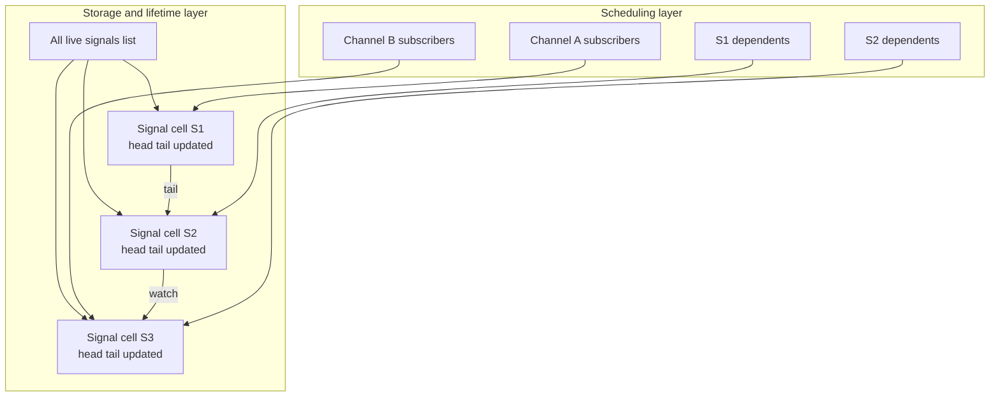
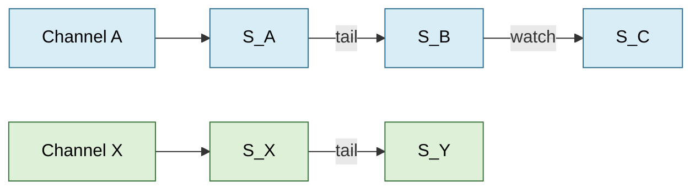
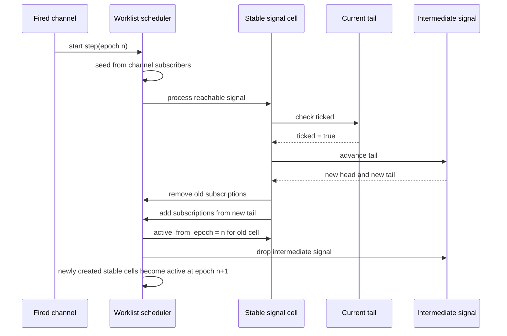

# Signal heap graph and scheduling notes

Created on the 26/03-2026

This note collects the conclusions from the recent discussion about whether the current signal heap could be changed from a globally scanned linked list into a more explicit runtime dependency graph.

The short version is:

- a graph-based scheduler is theoretically possible under the intended invariant that same-step dependencies are acyclic
- a graph over clocks alone is not enough
- the difficult part is not discovering dependencies, but preserving the current update semantics around stable signal identity, delayed activation, and dynamic rewiring
- the safest direction is a hybrid runtime: keep stable signal cells and likely an all-signals structure for lifetime management, while adding explicit dependency indices for scheduling

## What the current runtime is doing

Today the signal heap is a doubly-linked list of live signals.

That list is doing two jobs at once:

- it is a storage structure that keeps signals reachable for update and deallocation
- it is a scheduling structure that linearizes same-step dependencies into an update order

During a step, the runtime scans the whole heap. For each signal it checks whether the tail has ticked and, if so, advances the tail, produces an intermediate signal, and copies the intermediate signal's head and tail back into the original signal cell.

This means the current implementation is not merely "a heap of signals". It is a global ordered traversal discipline.

## Assumptions we are making

The proposed graph-based direction depends on the following assumptions.

### 1. Same-step dependencies are acyclic

This is the main semantic assumption.

If signals could form instantaneous cycles within a single step, then neither a topological scheduler nor a simple component-based parallel evaluation strategy would be sound.

The intended invariant is that same-step dependencies form a DAG, even though the overall long-lived runtime object graph can evolve over time.

### 2. Signal identity must stay stable across updates

Signals in Rizzo are mutable runtime cells. References held elsewhere should keep pointing to the same signal cell after time advances.

The current update semantics already rely on this: advancing a signal tail creates a fresh intermediate signal, but the original stable signal cell receives the new head and tail.

This has a major consequence for any graph design:

- graph nodes should represent stable signal cells, not temporary intermediate signals

### 3. Signals created during step n must not be processed until step n + 1

The current linked-list insertion behaviour enforces a phase separation: newly created signals are inserted relative to the current cursor so they do not participate again in the same traversal.

Any new scheduler must preserve the same rule explicitly.

### 4. The shape of dependencies is dynamic

The outgoing dependencies of a signal are determined by its current tail.

Since the tail changes after a successful advance, the graph is not static. It must support rewiring after updates.

### 5. Disconnected components are expected to be common enough to matter

The optimization argument becomes much stronger if typical programs contain several independent signal subgraphs, each driven by different channels or local chains of combinators.

If this is not true in practice, the extra graph machinery may not pay for itself.

## Issues we found

## 1. A graph over clocks is not sufficient

The supervisor notes ask whether we can compute clocks for later values and build the optimization around those clocks.

This is useful, but not enough.

The reason is that timing dependency and runtime dependency are not identical.

Examples:

- `wait c` depends on channel `c`
- `tail s` depends on whether `s` updated in the current step
- `watch s` depends on whether `s` updated and whether the new head of `s` is a `Some`

So `watch` is not only a timing edge. It is also guarded by a data-shape condition.

This means a pure clock graph would be too coarse to model the real update semantics.

## 2. The dependencies are present, but buried in the tail object

When a new signal is created, we usually do have access to the references it depends on, but not as one explicit parent pointer.

The dependency information is inside the `Later` value stored in the signal tail.

That means insertion into a graph is possible, but it requires traversing the tail and extracting dependencies such as:

- channel dependencies from `wait`
- signal dependencies from `tail s`
- signal dependencies plus a guard from `watch s`
- union of dependencies from `sync`
- dependencies inherited through the argument side of `laterapp`

So graph insertion is feasible, but no longer O(1) like the current linked-list splice.

## 3. Intermediate signals make simple graph insertion wrong

One of the most important implementation constraints is that `advance` creates an intermediate signal that is often used only to copy its head and tail back into the original signal.

If a graph scheduler were to attach edges to every newly constructed signal object, it would frequently attach them to the wrong node.

The correct owner of the dependencies is the stable signal cell that survives the step, not the temporary intermediate signal returned by `advance`.

This means rewiring must happen after copy-back to the original signal.

## 4. A static one-time graph build will not work

Because a signal tail can change every time the signal is updated, the dependency graph must be updated incrementally at runtime.

This affects both:

- which predecessors can trigger the signal in future steps
- which connected component the signal belongs to

So the cost question is not just "what does it cost to calculate the clock?"

The fuller question is:

- what does it cost to discover dependencies and guards from a tail
- what does it cost to remove the old subscriptions
- what does it cost to add the new subscriptions
- how often do updates cause meaningful rewiring

## 5. Nested delays show that potential dependencies and active dependencies differ

The example

```text
(fun x' -> (fun y' -> ...) |> y) |> x
```

shows that a later computation may first wait for one input and only later expose another dependency.

So there is a difference between:

- a conservative set of possible future dependencies
- the currently active dependencies that matter in the present step

This pushes the design toward a runtime graph of current subscriptions, rather than only a static over-approximation.

## 6. Scheduling and lifetime management should be separated

The linked list currently mixes two concerns:

- finding signals to update
- keeping live signals reachable for freeing, reuse, debugging, and global bookkeeping

Even if scheduling becomes graph-based, it still likely makes sense to retain some simpler all-signals structure for lifetime management.

This is especially relevant because deallocation and reference counting are orthogonal to the topological structure of the current active dependencies.

## 7. Parallel steps are only safe under extra conditions

Disconnected components suggest parallelism, but the runtime cannot safely become parallel just because the graph is disconnected on paper.

Extra concerns include:

- shared global scheduler state
- reference count updates on shared objects
- mutation of graph indices during rewiring
- deterministic output ordering for registered output signals

So the graph makes parallelism plausible, but not automatic.

## Proposed solution

The safest design is a hybrid one.

## 1. Keep stable signal cells as the fundamental runtime object

Signals should remain heap objects with stable identity.

Their payload can continue to be:

- `head`
- `tail`
- `updated`

The current signal object model still fits the semantics well.

## 2. Keep a simple all-signals structure for lifetime management

Even if the runtime no longer schedules by scanning a linked list, it is still useful to have a structure that contains all live signals for:

- deallocation bookkeeping
- debug printing
- output registration
- fallback validation of invariants

This structure could remain the existing linked list, or become a simpler live-set.

The key point is that it no longer needs to be the primary scheduler.

## 3. Add explicit dependency indices for scheduling

The new scheduling structure should represent current active dependencies.

At minimum it needs:

- channel -> signals waiting on that channel
- signal -> dependents that use `tail`
- signal -> dependents that use `watch`

It is likely useful to distinguish edge kinds, because `watch` has a stronger guard than `tail`.

## 4. Rewire dependencies from the signal tail

Dependency discovery should be performed by traversing the current tail.

That traversal should be used in two situations:

- when a genuinely new stable signal is created
- when an existing signal has just been updated and received a new tail

For updates, the correct order is:

1. advance the old tail to produce an intermediate signal
2. copy head and tail from the intermediate signal back into the original signal cell
3. remove the original signal's previous subscriptions
4. traverse the new tail now stored in the original signal
5. register the original signal's new subscriptions
6. free or drop the intermediate signal as usual

This preserves stable identity while making the graph reflect the new active dependencies.

## 5. Make activation explicit with epochs or pending sets

Newly created signals must not become eligible in the same step.

The cleanest replacement for the current cursor-based behaviour is an explicit activation discipline, for example:

- each signal has an `active_from_epoch`
- the scheduler processes only signals active in the current epoch
- signals created during the step are registered immediately but only activated in the next epoch

This makes the previous implicit invariant explicit.

## 6. Schedule reachable components, not the whole heap

When a channel fires, the runtime should:

1. seed a worklist from the signals subscribed to that channel
2. propagate through dependency edges to find the reachable active subgraph
3. evaluate signals in topological order inside each reachable component
4. leave all other components untouched

This is where the asymptotic win comes from.

## 7. Treat clock information as an optimization aid, not the whole model

Clock-like summaries are still useful.

They could support:

- fast rejection of obviously irrelevant components
- cached summaries of possible channels a tail may eventually depend on
- second-level shortcuts for skipping disjoint regions

But they should not replace the current active dependency graph entirely.

## Expected benefits

- avoid full-heap scans when only a small component is affected
- preserve the intended dependency ordering more explicitly
- make disconnected components visible to the runtime
- create a cleaner route toward future parallel stepping
- keep the semantics centred around stable signal cells

## Expected costs

- tail traversal on creation and rewiring
- dynamic maintenance of dependency indices
- extra memory for adjacency data and activation metadata
- more complex free/reuse logic because subscriptions must be removed as well as payload references
- more complicated debugging and invariant checking

## What still needs validation

Before implementing this design, the following questions should be checked empirically.

- How often are components truly disconnected in representative Rizzo programs?
- How often do signal updates significantly rewire dependencies?
- Is the runtime cost of extracting dependencies from tails lower than the cost of repeated full-heap scans?
- Is a full graph needed, or would a lighter-weight shortcut structure already capture most of the benefit?

## Recommended implementation order

The least risky path is:

1. keep the current all-signals linked list unchanged
2. add dependency extraction from `Later` values
3. add channel and signal subscriber tables beside the list
4. build a single-threaded incremental scheduler using those tables
5. only then consider parallel evaluation of disconnected components

This keeps the first version semantically close to the current runtime.

## Mermaid diagrams






