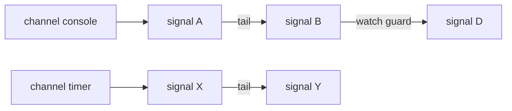

# Signal dependency graph and scheduling notes

Created on the 26/03-2026. Revised after checking the current C runtime.

This note revisits whether the current signal heap could be changed from a
globally scanned linked list into a dependency graph. The simpler conclusion is
that the useful graph is not a graph of clocks alone. It is a graph of active
runtime dependencies:

- channel nodes are external input sources
- signal nodes are the stable mutable signal cells already used by the runtime
- edges point from the thing that can update to the signal that may update next

In other words, the intended shape is close to a DAG rooted at channels. When a
channel steps, only the subgraph reachable from that channel needs to be
considered for that time step.

## What the current runtime does

The current C runtime stores all live signals in one doubly-linked list.
The list does two jobs at once:

- it keeps live signals reachable for update and deallocation
- it gives a global update order for same-step dependencies

When `rz_step(chan, v)` runs, it calls `rz_heap_update(chan, v)`. That function
scans every live signal. For each signal it:

1. checks whether the signal tail has ticked
2. if not, clears the signal's `updated` flag
3. if so, advances the tail, obtains an intermediate signal, copies the
   intermediate signal's head and tail back into the original signal cell, and
   marks the original cell as updated

The important implementation detail is that `tail s` and `watch s` do not ask
the channel directly. They check whether another signal has already been marked
as updated in the current step. For `watch s`, the new head must also be a `Some`.

So the linked list is not merely storage. It is also the current scheduling
discipline.

## Corrected model

The best mental model is:

```text
channel C  -> signal A -> signal B -> signal D
channel K  -> signal X -> signal Y
```

If channel `C` fires, the runtime should only need to consider `A`, `B`, and
`D`, in dependency order. Signals `X` and `Y` can be left untouched because they
cannot observe anything that happened in this step.

The graph edges should represent the currently active dependencies inside each
signal's current tail:

| Later form | Active dependency |
| --- | --- |
| `never` | none |
| `wait c` | channel `c` |
| `tail s` | signal `s` |
| `watch s` | signal `s`, guarded by `s.updated && s.head is Some` |
| `sync l1 l2` | union of dependencies from `l1` and `l2` |
| `f |> l` / `laterapp f l` | same active dependencies as `l` |

This is enough to support the desired optimization as a relevance filter: a
step on a channel only starts from signals subscribed to that channel, then
propagates through signal dependencies. It is not, by itself, enough to replace
the heap order with an arbitrary topological sort.

## What the older note got right

The older reasoning was right on the main constraints:

- a graph over clocks alone is too coarse
- dependency information is present in `Later` values
- signal identity must remain stable across updates
- dependencies can change after a signal updates
- new signals created during a step must not be processed in that same step

Those are real constraints in the runtime.

## What should be simplified

The graph does not need to start as a full general-purpose graph runtime with
components, parallel scheduling, and complex clock summaries.

The first useful version can be much smaller:

1. keep the linked list or another all-signals structure for lifetime/debugging
2. add subscriber lists beside the current heap:
   - `channel -> signals waiting on that channel`
   - `signal -> signals depending on tail/watch of that signal`
3. when a channel steps, seed a worklist from the channel subscriber list
4. process reachable signals in the existing heap order
5. after a signal updates, re-extract dependencies from its new tail and update
   the subscriber lists

This keeps the proposed change close to the current runtime. It changes the
scheduling structure first, not the signal object model.

## Counterexample to an edge-only topological order

The active `Later` graph is not a complete data-dependency graph for all reads
that can happen while advancing a tail.

For example, the standard library defines:

```rizz
fun sample xs ys = map (fun x -> (x, head ys)) xs
```

The resulting signal ticks when `xs` ticks. Its active `Later` dependency is
therefore on `xs`, not on `ys`. However, when the delayed function is advanced,
it reads the current head of `ys`.

If `xs` and `ys` can both update in the same time step, then the result of
`sample xs ys` depends on whether `ys` has already been processed. The current
linked-list scheduler handles this through heap order. A graph scheduler that
only sees the `tail xs` edge could incorrectly process the sampled signal before
`ys`, unless it preserves the existing heap order or also tracks head-read
dependencies inside delayed functions.

This is the main correction to the simplified DAG story:

- the graph over active `Later` dependencies is enough to decide which signals
  can possibly update after a channel step
- the existing heap order should remain the first scheduler order
- replacing that order with a pure graph topological sort requires a richer
  dependency analysis that includes same-step `head` reads

## Why a pure clock graph is not enough

A clock graph can say that a signal may eventually depend on a channel, but the
runtime needs to know the active same-step dependency.

For example:

- `wait c` directly depends on channel `c`
- `tail s` depends on whether `s` updated in this step
- `watch s` depends on whether `s` updated and whether the new head is `Some`
- `sync l1 l2` may update from either side, and `advance` must still know which
  side ticked

So clock summaries can be useful as an optimization or static approximation,
but they should not replace the active dependency graph.

## Stable signal cells matter

Signals in Rizzo behave like mutable runtime cells. Other values can hold
references to a signal, and those references must keep pointing to the same
signal after a time step.

That is why the current runtime copies the head and tail from an intermediate
signal back into the original signal. A graph scheduler must preserve that:

- graph nodes should be stable signal cells
- intermediate signals created by `advance` should not become permanent graph
  nodes unless they are genuinely retained by the program
- after copy-back, the original signal's subscriptions must be updated from its
  new tail

## Dynamic rewiring

The graph is not static. A signal's active dependencies are determined by its
current tail, and the tail can change whenever the signal updates.

After updating a signal, the scheduler must:

1. remove the signal from its old subscriber lists
2. inspect the new tail stored in the same stable signal cell
3. register the new active dependencies

This is the real cost of the optimization. The key empirical question is
whether maintaining these indices is cheaper than scanning the entire signal
heap on every step.

## Same-step activation

The linked list currently enforces a phase boundary with the heap cursor.
Signals created during an update are inserted into the already-processed part
of the list, so they are not visited again in the same traversal.

A graph scheduler needs an explicit equivalent. The simplest design is an
epoch field:

```text
signal.active_from_epoch
```

A signal created during epoch `n` can be registered in the dependency indices
immediately, but it must not be eligible for processing until epoch `n + 1`.

## Topological order

The current list works because a signal only depends on signals that are already
in the now heap. In graph terms, same-step dependencies should therefore be
acyclic and ordered from older prerequisites to newer dependents.

The graph scheduler can preserve this in one of two ways:

- maintain creation/list order as a topological order and process reachable
  signals according to that order
- compute a topological order for the reachable subgraph on each step, but only
  after the graph also accounts for same-step reads such as `head ys` inside
  delayed functions

The first option is likely the better initial design because it is closest to
the current implementation. The dependency indices would decide which signals
are relevant; the existing order would still decide how to process them.

## Practical proof sketch

The first graph scheduler can be proved correct by showing that it is equivalent
to the current heap scan except that it skips signals whose tails cannot tick.

Let `Reach(c)` be the set of active signal nodes reachable from channel `c` by
following:

- channel subscriptions from `wait c`
- signal subscriptions from `tail s`
- guarded signal subscriptions from `watch s`
- both sides of `sync`
- the later argument of `laterapp`

For a step on channel `c`, process only signals in `Reach(c)`, but process them
in the same relative order as the current linked list.

The proof obligation is then:

1. Soundness of skipping: if a signal is not in `Reach(c)`, then its current
   tail cannot tick on this step. The old heap scan would only set its
   `updated` flag to false, so skipping it is observationally equivalent only
   if all signals are treated as not updated at the beginning of the step,
   unless they are processed and updated in this step.
2. Completeness of processing: if a signal's tail can tick because of channel
   `c`, then it is in `Reach(c)`. This follows by structural induction on the
   current `Later` value: `wait` is seeded directly, `tail` and `watch` are
   reached through the source signal's update edge, `sync` is the union of its
   arguments, and `laterapp` has the same tick condition as its later argument.
3. Order preservation: every processed signal is evaluated in the same order as
   the linked-list scheduler. Therefore reads of `updated` flags and reads of
   signal heads inside delayed functions observe the same state as before.
4. Stable identity: updates still copy the intermediate signal's head and tail
   back into the original signal cell, so references to signals remain valid.
5. Dynamic rewiring: after updating a signal, its old subscriptions are removed
   and its new tail is inspected to install the subscriptions for future steps.
   This maintains the definition of `Reach(c)` for the next step.
6. Phase separation: signals created during epoch `n` are not eligible until
   epoch `n + 1`, matching the current cursor discipline.

This proof supports the conservative version: dependency indices plus existing
heap order. A stronger scheduler that computes its own topological order would
need an additional proof that its graph includes every same-step ordering
dependency, including `head` reads hidden inside delayed functions.

## What the Lean metatheory tells us

The Lean formalisation in `rizzo-metatheory` is useful because it separates the
semantic facts from the implementation choices.

The key definitions line up with the graph idea:

- `Term.ticked` is structurally defined over `wait`, `trig`/`watch`, `never`,
  `sync`, `appE`, and `tail`
- `appE` has the same tick condition as its later argument
- `tail` and `trig`/`watch` inspect whether another signal in the now heap has
  ticked
- `Update.skip` moves a signal unchanged into the now heap but sets its ticked
  flag to false
- `Update.adv` advances a ticking tail, reads the intermediate signal, and
  writes the ticked result back at the original location

This supports the reachability proof for active `Later` dependencies. We can
define a dependency extraction function over `Val` and prove:

```text
t.ticked now c = true -> owner is reachable from c
owner not reachable from c -> t.ticked now c = false
```

The proof should be by structural induction on the `Later` value, following the
same cases as `Term.ticked`.

The Lean semantics also shows why the optimized runtime needs epoch-style
updates. In the formal `skip` rule, a skipped signal is explicitly moved to the
now heap with `ticked = false`. If an implementation simply avoids touching
unreachable signals, their previous `updated = true` flag could survive into the
next step and make `tail` or `watch` dependents tick incorrectly.

A concrete bad shape is:

```rizz
sync (wait c) (tail y)
```

If `y` updated in the previous step, but not in the current step, then the
`tail y` side must be false. A graph scheduler that does not clear or epoch the
updated flag could incorrectly treat both sides of the `sync` as ticking.

The practical implementation should therefore prefer:

```text
signal.updated_epoch : Nat
current_epoch : Nat
signal.updated = (signal.updated_epoch == current_epoch)
```

Then non-reachable signals are automatically not updated in the current step
without requiring a full heap pass to clear booleans.

The Lean semantics also confirms the limitation of an edge-only scheduler.
`Eval.head` reads from the now heap, and `Adv.appE` evaluates an arbitrary
delayed function after the later argument has advanced. So delayed functions can
contain same-step `head` reads that are not visible in the active `Later`
dependency graph. That is the formal version of the `sample xs ys`
counterexample above.

The most defensible formal route is:

1. define `deps : Val -> DepSet` for active `Later` dependencies
2. define `Reach(c)` from those dependencies
3. define an optimized update relation that:
   - treats all old tick flags as false by epoch
   - updates only signals in `Reach(c)`
   - processes those signals in the same order as `Updates`
   - rewires dependencies after each update
4. prove the optimized relation produces the same final heap and channel context
   as `ReactStep`

Once that equivalence theorem exists, the existing Lean theorems about
determinism, preservation, productivity, and causality should transfer to the
graph scheduler.

## Recommended first implementation

The least risky implementation plan is:

1. keep stable `rz_signal_t` cells and the current list for lifetime management,
   output registration, and debugging
2. add dependency extraction for `Later` values
3. store active subscriptions:
   - `wait c`: subscribe the owner signal to channel `c`
   - `tail s`: subscribe the owner signal as a dependent of `s`
   - `watch s`: subscribe the owner signal as a guarded dependent of `s`
   - `sync`: recurse into both sides
   - `laterapp`: recurse into the later argument
4. on `rz_step(chan, v)`, collect the reachable set from `chan`
5. process only that reachable set, in the existing heap order
6. after each updated signal, rewire its subscriptions from the new tail
7. keep a full-heap scan mode as a debug oracle until the graph scheduler is
   validated

This would make the desired semantics explicit: stepping a channel only affects
signals reachable from that channel for that time step.

## Expected benefits

- avoids full-heap scans when a program has independent signal subgraphs
- makes the dependency ordering visible instead of implicit in one list
- keeps the stable signal-cell semantics unchanged
- creates a cleaner path to later parallelization of independent components

## Expected costs

- extra memory for subscriber lists and per-signal subscription metadata
- extra work when a signal's tail changes and dependencies must be rewired
- more complicated deallocation, because a signal must be removed from
  subscriber lists as well as from the signal heap
- more invariants to test, especially around `watch`, `sync`, and signals
  created during an update

## Open questions

- How often do representative Rizzo programs contain independent channel-rooted
  subgraphs?
- How often do signal tails rewire to substantially different dependencies?
- Is processing the reachable set in existing heap order fast enough, or is a
  dedicated topological scheduler needed?
- Can dependency extraction be made cheap enough to beat repeated full-heap
  scans?

## Mermaid sketch


```mermaid
flowchart LR
    C1["channel console"] --> A["signal A"]
    A -->|tail| B["signal B"]
    B -->|watch guard| D["signal D"]

    C2["channel timer"] --> X["signal X"]
    X -->|tail| Y["signal Y"]
```

If `console` steps, only `A`, `B`, and possibly `D` are considered. The timer
subgraph is untouched for that step.
